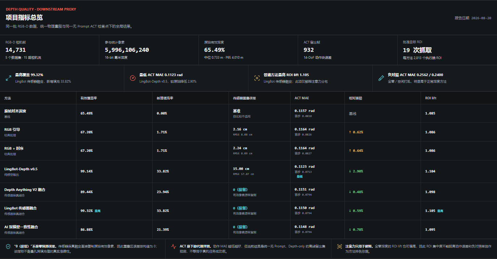

# HHW RGB-D 深度处理项目

本项目用于从 `/ssd/hhw/depth` 下的 5 个 ROS1 bag 中提取、处理并对比物理尺度深度数据。
项目不会修改源 rosbag，也不会修改服务器上的官方模型仓库。

## RGB-D Depth Lab 在线展示

[打开完整交互页面](https://expolrer.github.io/depth-process/) ·
[深度处理对比](https://expolrer.github.io/depth-process/?view=depth) ·
[ACT 热力图对比](https://expolrer.github.io/depth-process/?view=attention) ·
[接触关键帧与批准 ROI](https://expolrer.github.io/depth-process/attention_review/) ·
[四类深度质量证据](https://expolrer.github.io/depth-process/quality_evidence/) ·
[RGB-D 数据增强审计](https://expolrer.github.io/depth-process/augmentation/)

[](https://expolrer.github.io/depth-process/?view=depth)

在线页面包含 5 个数据集和 85 个完整同步视频，可在 Head、Left Wrist、Right Wrist 三视角下切换
7 种深度处理方法，并对比对应的无 Prompt ACT 热力图、动作误差和执行腕目标 ROI 指标。
页面静态资源位于 `docs/`，GitHub Pages 发布源应设置为 `main` 分支的 `/docs` 目录。

## 项目指标总览

全量深度统计覆盖 5 个数据集、15 路相机流、14,731 个 RGB-D 相机帧和
5,996,106,240 个像素。原始对齐深度有效率为 65.49%，深度中位数为 0.733 m，
P95 为 4.010 m。下游代理评测使用同一个无 Prompt、Depth-only ACT 检查点，
在 932 个留出帧上计算 14-DoF 动作块误差。

| 方法 | 有效覆盖率 | 新增填充率 | 传感器重叠 MAE | ACT chunk MAE | 相对原始 ACT | 执行腕 ROI lift |
| --- | ---: | ---: | ---: | ---: | ---: | ---: |
| 原始对齐深度 | 65.49% | 0.00% | 基准 | 0.1157 rad | 基线 | 1.085 |
| RGB 引导 | 67.20% | 1.71% | 2.16 cm | 0.1164 rad | 上升 0.62% | 1.086 |
| RGB + 时序 | 67.20% | 1.71% | 2.24 cm | 0.1164 rad | 上升 0.64% | 1.086 |
| LingBot-Depth v0.5 | 99.14% | 33.82% | 15.00 cm | **0.1123 rad** | **降低 2.90%** | 1.104 |
| Depth Anything V2 融合 | 89.44% | 23.94% | 0（保留） | 0.1151 rad | 降低 0.48% | 1.098 |
| LingBot 传感器融合 | **99.32%** | **33.82%** | 0（保留） | 0.1150 rad | 降低 0.59% | **1.105** |
| AI 双模型一致性融合 | 86.88% | 21.39% | 0（保留） | 0.1148 rad | 降低 0.78% | 1.095 |

`新增填充率` 是“原始无效、处理后有效”的像素占全部像素的比例。融合方法的
`0（保留）` 表示其直接复制原始有效传感器像素，因此重叠区误差按构造为 0；
它不代表孔洞填充值具有零误差。ACT 是离线下游代理评测，不等同于真机成功率。
全零深度和空间打乱深度的 ACT MAE 分别为 0.2562 和 0.2400 rad，明显劣于正常方法；
但全零深度的 ROI lift 仍可偏高，因此注意力集中度不能脱离动作误差和负对照单独排名。

首页指标数据同时保存为 `docs/data/depth_quality_metrics.json`，便于复核或二次分析。

## 四类无模型深度质量证据

最新评估覆盖 5 个数据集、15 路相机视图、180 帧空间质量样本、90 个时序片段和
410 帧人工批准任务 ROI。计算过程只使用 RGB、深度、时序对应关系和批准 ROI，
不调用注意力图或训练后的动作策略，因此可在不占用训练 GPU 的情况下复核：

| 证据 | 主要结果 | 解读边界 |
| --- | --- | --- |
| 无模型深度质量 | LingBot v0.5 的 RGB-Depth 边缘 F1 为 **0.437**，原始深度为 0.287；时序残差由 11.24 mm 降至 **3.72 mm** | 平滑度降低也可能是过度平滑，需与边缘保留共同分析 |
| 自然遮挡恢复 | LingBot 传感器融合恢复覆盖率 **99.72%**，5 cm 内正确率 **83.48%** | 仅评估前后帧可双向观测的自然孔洞，不是激光真值 |
| 三视角几何一致性 | LingBot v0.5 主要平面 RMSE 最低，为 **6.90 mm** | rosbag 缺少公共机器人坐标系外参，这是旋转不变几何代理，不是严格重投影误差 |
| 任务目标 ROI 几何 | LingBot 传感器融合 ROI 覆盖率和边界完整率均为 **99.9%**；原始深度为 64.6% 和 61.2% | 反映目标区域深度可用性，不等同于抓取成功率 |

完整数值、方法排名、代表帧与限制说明保存在 `docs/quality_evidence/`。评估脚本为
`scripts/evaluate_depth_quality_evidence.py`，与模型训练进程相互独立。

## 两套 RGB-D 数据增强版本

增强代码位于 `depth_pipeline/augmentation.py`，配置和深度提取、修复、融合、评估脚本独立：

- `config/rgb_augmentation_only.yaml`：仅修改 RGB，深度始终保持原值，适合作为 RGB 鲁棒性消融对照。
- `config/rgbd_paired_augmentation.yaml`：`RandomMask` 和 `RandomBorderCutout` 对 RGB 与深度使用同一空间掩码；亮度、对比度、饱和度、色相、锐度、RGB 高斯噪声和 Gamma 只改变 RGB，metric depth 保持原值。
- 每次最多执行一种变换；Identity 权重为 3，采样概率 25%，其余 9 种策略权重均为 1，采样概率各 8.33%。固定 seed 可复现采样结果。
- 版本一用于对照；对于真正读取对齐 RGB-D 的 DataLoader，优先使用版本二，避免空间遮挡造成跨模态错位。若训练仓库只读取预计算 RGB VAE latent，应在 latent 提取前完成 RGB 增强。

三视角审计页位于 `docs/augmentation/`，覆盖 5 个数据集、15 路相机、10 种策略和
150 个固定种子样例。随机遮挡的 RGB-D 配对掩码 IoU 为 **1.000**。

## 机器人交互目标自动标注

仓库包含三套独立、可安装的自动标注项目：

| 项目 | 技术路线 | 入口 |
| --- | --- | --- |
| `interaction-labeler-v1/` | GroundingDINO 候选、RGB-D/夹爪/关节排序、VLM 消歧、SAM2 双向跟踪、人工抽检 | `interaction-labeler run` |
| `interaction-auto-labeler-v2/` | 目标描述、头部全场盘点、阶段识别、交互证据评分、跨视角关联、风险帧复核 | `auto-labeler-v2 run` |
| `interaction-auto-labeler-v3/` | 事件图与 LeRobot v3、分层边界/语言、可靠度/GVL/异常、动态 FK/6D、纠错蒸馏和 ACT/π0.5 消融 | `auto-labeler-v3 run` |

三个入口均接受原始 ROS bag、LeRobot 根目录或已提取 RGB-D 目录，并自动打开本地互动页面。
页面允许在模型运行前画目标框、修正接触帧，也允许在模型运行后对任意帧增加修正框并重新运行
SAM2。人工框不写入 RGB 像素，而是保存为可追踪的覆盖记录。

V3 同样接受三类输入，并保持 V1/V2 不变。它把自动结果写成逐 episode 统一事件图，所有人工修改
另存为追加式纠错日志；未经过金标校准、缺少 GVL 进度响应或多模态异常检查的结果会进入复核，
缺少三维标定时不生成几何真值。完整命令与 P0-P4 验收边界见
[`interaction-auto-labeler-v3/README.md`](interaction-auto-labeler-v3/README.md)。

```bash
auto-labeler-v2 run \
  --data /ssd/hhw/zhuomian/lerobot \
  --format lerobot \
  --workspace /ssd/hhw/annotations/zhuomian_v2 \
  --task interaction-auto-labeler-v2/configs/example_task.yaml \
  --concept-model /ssd/hhw/depth-processing/models/grounding-dino-base \
  --vlm-model /ssd/hhw/models/internvla_a1_5/Qwen3.5-2B
```

ACT、pi0.5/OpenPI 和通用 VLA 的接入代码与防止未来信息泄漏的实验方案位于
`training_integrations/`。默认优先把 bbox/mask 用作辅助目标定位监督；只有部署端也运行在线
检测器时，才将目标 crop 或 ROI token 作为策略的必需输入。

## 相机处理方式

- `cam_h`：Orbbec Gemini-335L。录制的深度图已经位于彩色相机光学坐标系中。
- `cam_l`、`cam_r`：Intel RealSense D405。使用 rosbag 中记录的深度/彩色相机内参、畸变参数和 `/tf_static`，将原始校正深度投影到 RGB 图像坐标系。
- RGB 与深度帧按照最接近的 bag 接收时间戳配对。绝大多数数据流的时间偏差 P95 小于 16 ms，低于约 33 ms 帧周期的一半。
- 深度图以无损 `uint16` PNG 保存，单位为毫米；像素值 `0` 表示无效深度。

## 已实现的处理结果

| 目录 | 用途 |
| --- | --- |
| `depth_raw_mm` | rosbag 中压缩深度 PNG 的原始无损数据 |
| `depth_aligned_rgb_mm` | 已配准到 RGB 坐标系的 D405 深度图 |
| `rgb_guided` | 中值离群点抑制、有限范围孔洞修复和 RGB 引导滤波 |
| `temporal_rgb_guided` | 在 RGB 引导结果上加入光流对齐的时序稳定处理 |
| `lingbot_v05` | LingBot-Depth v0.5 官方模型输出的纯模型物理尺度深度 |
| `depth_anything_v2_fused` | 将 Depth-Anything-V2 相对深度逐帧标定后，与传感器深度融合 |
| `lingbot_v05_sensor_fused` | 保留传感器原始有效像素，仅使用 LingBot 结果填补空洞 |
| `ai_consensus_fused` | 保留传感器深度，仅在 LingBot 与 Depth-Anything 预测一致的位置填补空洞 |
| `lingbot_cross_attention` | LingBot 深度查询到 RGB Token 的跨模态注意力热力图 |
| `lingbot_depth_token_attention` | LingBot CLS 查询到深度 Token 的注意力热力图 |

相比完全使用模型预测替换传感器深度，保留传感器有效像素的融合结果和双模型一致性结果更适合作为 VLA 训练候选数据。纯模型输出仍会保留，供分析和对比使用。

## 主要命令

```bash
cd /ssd/hhw/depth-processing

.venv/bin/python scripts/inspect_bags.py /ssd/hhw/depth \
  --output reports/bag_inventory.json

.venv/bin/python scripts/extract_rgbd.py /ssd/hhw/depth \
  --output-root outputs/extracted --workers 16

.venv/bin/python scripts/align_depth_to_rgb.py \
  --input-root outputs/extracted

.venv/bin/python scripts/process_classical.py \
  --input-root outputs/extracted --output-root outputs/processed

OVERWRITE=1 BATCH_SIZE=4 scripts/run_lingbot_8gpu.sh
OVERWRITE=1 BATCH_SIZE=8 scripts/run_depth_anything_8gpu.sh
GPU_IDS=0,6,7 BATCH_SIZE=4 scripts/run_lingbot_attention_gpus.sh

.venv/bin/python scripts/fuse_ai_outputs.py \
  --input-root outputs/extracted --processed-root outputs/processed

.venv/bin/python scripts/generate_comparisons.py \
  --input-root outputs/extracted \
  --processed-root outputs/processed \
  --output-root outputs/comparisons

.venv/bin/python scripts/compute_depth_norm_stats.py \
  --input-root outputs/extracted \
  --processed-root outputs/processed \
  --output outputs/reports/norm_stats.json

.venv/bin/python scripts/validate_outputs.py \
  --project-root /ssd/hhw/depth-processing \
  --lingbot-checkpoint /ssd/hhw/lingbot-depth/checkpoint/lingbot-vla-v2-depth/model.pt \
  --depth-anything-checkpoint /ssd/hhw/Depth-Anything-V2/checkpoints/depth_anything_v2_vits.pth \
  --output outputs/reports/validation_report.json

.venv/bin/python scripts/build_video_viewer.py \
  --project-root /ssd/hhw/depth-processing \
  --workers 8

python3 viewer/serve_viewer.py --host 127.0.0.1 --port 8765
```

The video viewer presents synchronized head, left-wrist, and right-wrist RGB streams with two
independently selectable depth-processing rows. Videos use a fixed 0.2-4.0 m Turbo color scale;
invalid depth is shown near black. The bundled server supports byte-range requests for responsive
seeking.

## 注意力热力图

`process_lingbot_attention.py` 从官方 LingBot-Depth v0.5 RGB-D ViT 中提取真实模型注意力。
脚本通过编码器第 20–23 层的 `qkv` 投影精确重算所需的多头注意力矩阵行：

- 跨模态注意力：有效深度查询到全部 RGB Key 的注意力，聚合层、注意力头和采样查询。
- 深度 Token 注意力：CLS 查询到全部深度 Key 的注意力，聚合层和注意力头。
- 原始相对分数以无损 16-bit PNG 保存，页面叠加图以 Inferno 色标保存为 JPEG。
- 可视化按每帧 P5–P99.5 归一化；归一化前的概率统计保存在分片报告中。

这些热力图解释的是 LingBot-Depth RGB-D 编码器，不是 VLA 动作策略中受任务提示词调节的注意力，
因此不能直接解释为抓取或操作决策区域。

## 模型位置

- LingBot-Depth 仓库：`/ssd/hhw/lingbot-depth`
- LingBot-Depth v0.5 权重：
  `/ssd/hhw/lingbot-depth/checkpoint/lingbot-vla-v2-depth/model.pt`
- Depth-Anything-V2 仓库：`/ssd/hhw/Depth-Anything-V2`
- Depth-Anything-V2-Small 权重：
  `/ssd/hhw/Depth-Anything-V2/checkpoints/depth_anything_v2_vits.pth`

## 测试结果说明

运行以下命令可执行项目的自动化测试：

```bash
PYTHONPATH=. .venv/bin/python -m pytest -q tests
```

当前测试集包含 7 个自动化测试：

1. `tests/test_rosbag_extract.py`：验证 RGB 与深度帧的最近时间戳配对逻辑。
2. `tests/test_fusion.py`：验证 Depth-Anything 相对逆深度的物理尺度标定，以及传感器深度与模型预测的融合逻辑。
3. `tests/test_augmentation.py`：5 个测试覆盖确定性采样、RGB-only 深度不变、配对空间掩码、光度变换深度不变和权重概率。

测试通过不代表仅凭单元测试就证明全部深度图的视觉质量完全正确。完整数据集是否有漏帧、输出尺寸是否一致、模型权重是否匹配等内容，由 `scripts/validate_outputs.py`、四类质量证据和生成的验证报告另外检查。

## 方法适用范围

ClearGrasp 和 TransCG 需要透明物体监督数据或合适的预训练权重，不能直接作为适用于所有图像帧的通用滤波器。MonoGS/NeRF 需要相机轨迹，并通常假设场景基本静态。在缺少掩码、位姿和对应场景假设时，不应把这些方法标记为已经在本批 rosbag 上完成。

当前已经导出的 RGB、原始/配准深度、相机内参、坐标变换、时间戳和清单文件，可以支持后续接入这些处理后端。
